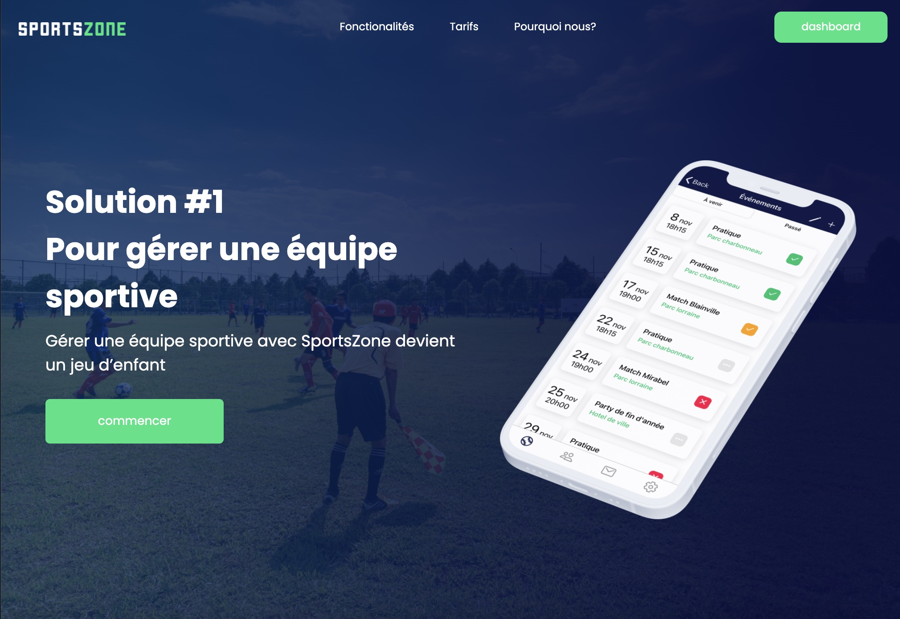

# SportsZone

This is a sports team management app I built in 2020 during Covid using Angular Ionic, node.js, Mongodb, and plain HTML/JS/CSS. 

The project eventually got dropped due to lack of time, but it includes all the major features you would expect in a Team management app.

The app works on android, iOS and the web and here's a quick <a href="https://www.youtube.com/watch?v=IpDjCxJ37_o&ab_channel=AdrienTrahan">demo</a>.

**Here's a non-exhaustive list of all implemented features:**

- [x] Creation of events (recurring or not) by specifying locations, time and other information (score, opponent and game statistics, etc.)
- [x] Email notification for each added, modified or deleted event (can be disabled by user) 
- [x] Individual attendance display
- [x] Internal messaging (group or alone) with the possibility of exchanging multimedia content and files
- [x] Hierarchy and permission system (coach, sub-coach, parent, player)
- [x] Simple membership system (qr code or link) and eviction system
- [x] Individual player statistics
- [x] Contact sheets
- [x] English and French support

